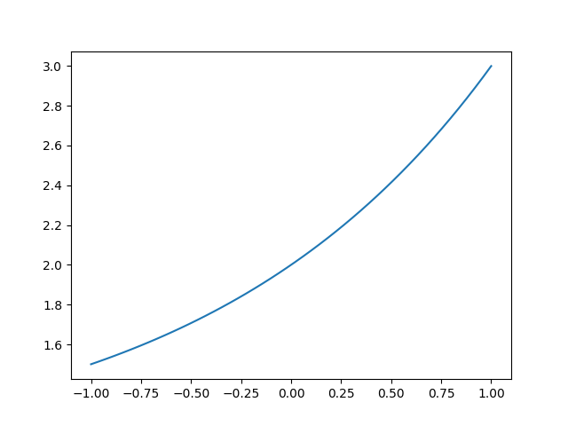
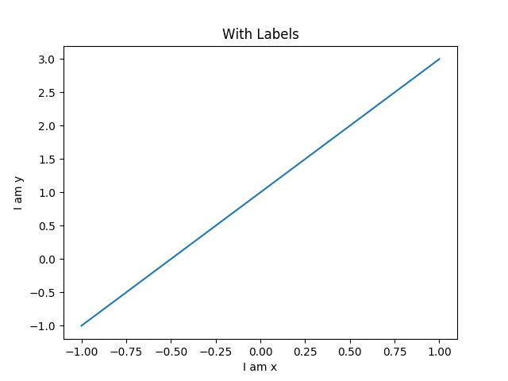
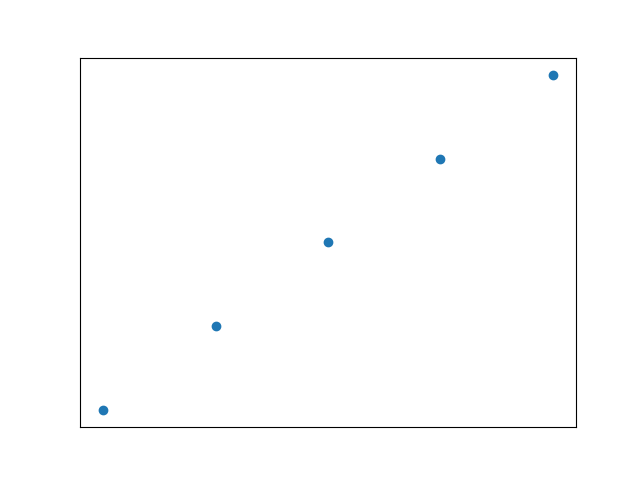
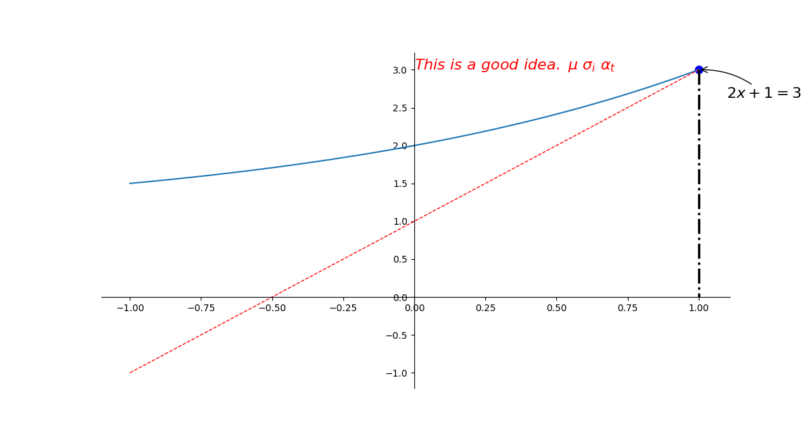

# Line Chart in Matplotlib

A line chart is a simple way to visualize data where we connect individual data points. It helps us to see trends and patterns over time or across categories. 
<br> This type of chart is particularly useful for: </br>
* Comparing Data: Comparing multiple datasets on the same axes.
* Highlighting Changes: Illustrating changes and patterns in data.
* Visualizing Trends: Showing trends over time or other continuous variables.

## Prerequisites
Line plots can be created in Python with Matplotlib's ``pyplot`` library. To build a line plot, first import ``Matplotlib``. It is a standard convention to import Matplotlib's pyplot library as ``plt``.
```
import matplotlib.pyplot as plt

```

## Creating a simple Line Plot

First import matplotlib and numpy, these are useful for charting.
<br> You can use the ``plot(x,y)`` method to create a line chart.</br>

```
import matplotlib.pyplot as plt
import numpy as np

x = np.linspace(-1, 1, 50)
print(x)
y = 2*x + 1

plt.plot(x, y)
plt.show()
```
When executed, this will show the following line plot:


## Curved line

The ``plot()`` method also works for other types of line charts. It doesn’t need to be a straight line, y can have any type of values.
```
import matplotlib.pyplot as plt
import numpy as np

x = np.linspace(-1, 1, 50)
y = 2**x + 1

plt.plot(x, y)  
plt.show()
```
When executed, this will show the following Curved line plot:




## Line with Labels

To know what you are looking at, you need meta data. Labels are a type of meta data. They show what the chart is about. The chart has an ``x label``, ``y label`` and ``title``.
```
import matplotlib.pyplot as plt
import numpy as np

x = np.linspace(-1, 1, 50)
y1 = 2*x + 1
y2 = 2**x + 1

plt.figure()
plt.plot(x, y1)  

plt.xlabel("I am x")
plt.ylabel("I am y")
plt.title("With Labels")

plt.show()
```
When executed, this will show the following line with labels plot:



## Multiple lines

More than one line can be in the plot. To add another line, just call the ``plot(x,y)`` function again. In the example below we have two different values for ``y(y1,y2)`` that are plotted onto the chart.

```
import matplotlib.pyplot as plt
import numpy as np

x = np.linspace(-1, 1, 50)
y1 = 2*x + 1
y2 = 2**x + 1

plt.figure(num = 3, figsize=(8, 5))
plt.plot(x, y2)
plt.plot(x, y1, 
         color='red',   
         linewidth=1.0,  
         linestyle='--' 
        )

plt.show()
```
When executed, this will show the following Multiple lines plot:


## Dotted line

Lines can be in the form of dots like the image below. Instead of calling ``plot(x,y)`` call the ``scatter(x,y)`` method. The ``scatter(x,y)`` method can also be used to (randomly) plot points onto the chart.

```
import matplotlib.pyplot as plt
import numpy as np

n = 1024
X = np.random.normal(0, 1, n)
Y = np.random.normal(0, 1, n)
T = np.arctan2(X, Y)

plt.scatter(np.arange(5), np.arange(5))

plt.xticks(())
plt.yticks(())

plt.show()
```

When executed, this will show the following Dotted line plot:



## Line ticks

You can change the ticks on the plot. Set them on the ``x-axis``, ``y-axis`` or even change their color. The line can be more thick and have an alpha value.

```
import matplotlib.pyplot as plt
import numpy as np

x = np.linspace(-1, 1, 50)
y = 2*x - 1

plt.figure(figsize=(12, 8)) 
plt.plot(x, y, color='r', linewidth=10.0, alpha=0.5)

ax = plt.gca()

ax.spines['right'].set_color('none')
ax.spines['top'].set_color('none')

ax.xaxis.set_ticks_position('bottom')
ax.yaxis.set_ticks_position('left')

ax.spines['bottom'].set_position(('data', 0))
ax.spines['left'].set_position(('data', 0))

for label in ax.get_xticklabels() + ax.get_yticklabels():
    label.set_fontsize(12)
    label.set_bbox(dict(facecolor='y', edgecolor='None', alpha=0.7))

plt.show()
```

When executed, this will show the following line ticks plot:


## Line with asymptote

An asymptote can be added to the plot. To do that, use ``plt.annotate()``. There’s lso a dotted line in the plot below. You can play around with the code to see how it works.

```
import matplotlib.pyplot as plt
import numpy as np

x = np.linspace(-1, 1, 50)
y1 = 2*x + 1
y2 = 2**x + 1

plt.figure(figsize=(12, 8))  
plt.plot(x, y2)
plt.plot(x, y1, color='red', linewidth=1.0, linestyle='--')

ax = plt.gca()

ax.spines['right'].set_color('none')
ax.spines['top'].set_color('none')

ax.xaxis.set_ticks_position('bottom')
ax.yaxis.set_ticks_position('left')

ax.spines['bottom'].set_position(('data', 0))
ax.spines['left'].set_position(('data', 0))


x0 = 1
y0 = 2*x0 + 1

plt.scatter(x0, y0, s = 66, color = 'b')
plt.plot([x0, x0], [y0, 0], 'k-.', lw= 2.5)

plt.annotate(r'$2x+1=%s$' % 
             y0, 
             xy=(x0, y0), 
             xycoords='data',
             
             xytext=(+30, -30),
             textcoords='offset points',
             fontsize=16,  
             arrowprops=dict(arrowstyle='->',connectionstyle='arc3,rad=.2')
            )

plt.text(0, 3, 
         r'$This\ is\ a\ good\ idea.\ \mu\ \sigma_i\ \alpha_t$',
         fontdict={'size':16,'color':'r'})

plt.show()
```

When executed, this will show the following Line with asymptote plot:



## Line with text scale

It doesn’t have to be a numeric scale. The scale can also contain textual words like the example below. In ``plt.yticks()`` we just pass a list with text values. These values are then show against the ``y axis``.

```
import matplotlib.pyplot as plt
import numpy as np

x = np.linspace(-1, 1, 50)
y1 = 2*x + 1
y2 = 2**x + 1

plt.figure(num = 3, figsize=(8, 5))  
plt.plot(x, y2)

plt.plot(x, y1, 
         color='red',  
         linewidth=1.0,  
         linestyle='--'  
        )

plt.xlim((-1, 2))  
plt.ylim((1, 3))  

new_ticks = np.linspace(-1, 2, 5)
plt.xticks(new_ticks)
plt.yticks([-2, -1.8, -1, 1.22, 3],
          [r'$really\ bad$', r'$bad$', r'$normal$', r'$good$', r'$readly\ good$'])

ax = plt.gca()
ax.spines['right'].set_color('none')
ax.spines['top'].set_color('none')

ax.xaxis.set_ticks_position('bottom')
ax.yaxis.set_ticks_position('left')

ax.spines['bottom'].set_position(('data', 0))
ax.spines['left'].set_position(('data', 0))

plt.show()
```
When executed, this will show the following Line with text scale plot:


